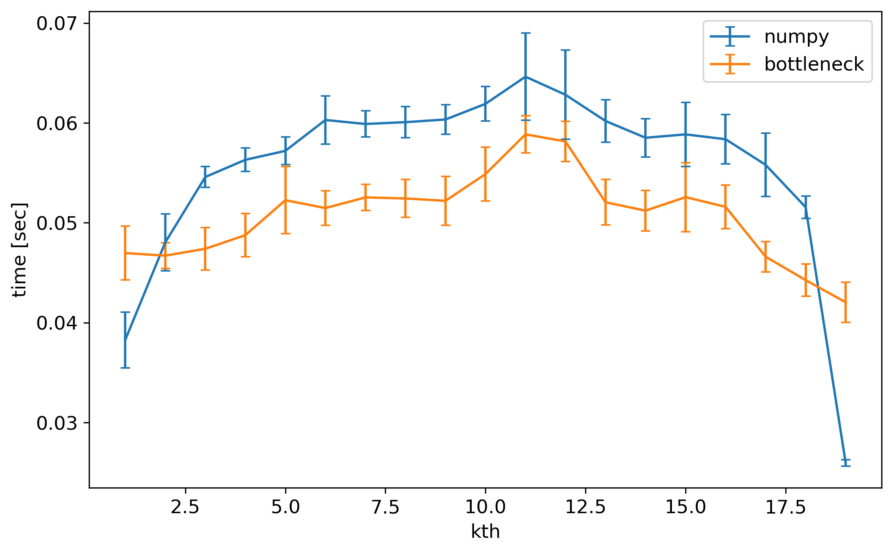

# Benchmark related to sorting

There are many possible choices for sorting the array, which is necessary especially for rejection algorithms. For example, think about MINMAX rejection, i.e., you have to remove certain number of pixels of lowest/highest values at each position. You have to know at which position in the (N+1)-D array (N = number of images to combine) to be masked, and that means we have to somehow "sort" the values along the dimesion of which the images are stacked (usually axis 0).

One possibility is to sort all the pixels along axis 0, remove the outliers such as minimum/maximum values and convert it to mask by certain algorithms. But trivially this must be slower than ``argpartition`` of numpy, and hence it is not useful for our purposes.


## Benchmark on ``argpartition``
There are two options for ``argpartition``, i.e., numpy and bottleneck. Unfortunately, bottleneck version does not support NaN at the moment (2020-07-21 20:05:11 (KST: GMT+09:00)), and hence, we need to convert the NaN values to some extreme but non-NaN real values, and this must act as an overhead (find NaN && replace it to strange values).

Below, I compare the ways to find the location of the largest value

1. Use ``np.argpartition`` with the given ``kth`` along ``axis=0``
2. Use ``d[np.isnan(d)] = very_large_value`` and ``bn.argpartition`` with given ``kth`` along ``axis=0``

```python
import numpy as np
import bottleneck as bn

np.random.seed(12345)
satlevel = 1.e+10
data3d = np.random.normal(size=(20, 1000, 200))
mask3d = np.zeros_like(data3d).astype(bool)
data3d_nan = data3d.copy()
mask3d_nan = mask3d.copy()
mask3d_nan[3, 10:20, 10:25] = True
mask3d_nan[4, 89:99, 60:70] = True
data3d_nan[mask3d_nan] = np.nan

t = dict(np=[], e_np=[], bn=[], e_bn=[])

for k in range(1, 20):
    kw = dict(a=data3d_nan, kth=k, axis=0)
    print(k)
    res_bn = bn.argpartition(**kw)
    res_np = np.argpartition(**kw)
    d = data3d_nan.copy()
    res_bnnan = bn.argpartition(d, kth=k, axis=0)

    # First, test if the results are identical
    np.testing.assert_array_almost_equal(
        np.sum(res_np[:k, :, :], axis=0),
        np.sum(res_bnnan[:k, :, :], axis=0)
    )

    print("BN (naive): ", end='')
    %timeit -n 1 -r 10 bn.argpartition(**kw)  # NaN is not supported.
    print("numpy     : ", end='')
    t_np = %timeit -n 1 -r 10 -o np.argpartition(**kw)  # NaN is regarded as infinity

    d = data3d_nan.copy()
    print("BN        : ", end='')
    t_bn = %timeit -n 1 -r 10 -o d[np.isnan(d)] = satlevel; bn.argpartition(d, kth=k, axis=0)
    t['np'].append(t_np.average)
    t['bn'].append(t_bn.average)
    t['e_np'].append(t_np.stdev)
    t['e_bn'].append(t_bn.stdev)
```

<details><summary>Results (click)</summary>
<p> <pre>
1
BN (naive): 42.4 ms +/- 3.28 ms per loop (mean +/- std. dev. of 10 runs, 1 loop each)
numpy     : 38.3 ms +/- 2.79 ms per loop (mean +/- std. dev. of 10 runs, 1 loop each)
BN        : 47 ms +/- 2.69 ms per loop (mean +/- std. dev. of 10 runs, 1 loop each)
2
BN (naive): 46.7 ms +/- 2.09 ms per loop (mean +/- std. dev. of 10 runs, 1 loop each)
numpy     : 48 ms +/- 2.83 ms per loop (mean +/- std. dev. of 10 runs, 1 loop each)
BN        : 46.7 ms +/- 1.28 ms per loop (mean +/- std. dev. of 10 runs, 1 loop each)
3
BN (naive): 43.3 ms +/- 1.87 ms per loop (mean +/- std. dev. of 10 runs, 1 loop each)
numpy     : 54.6 ms +/- 1.04 ms per loop (mean +/- std. dev. of 10 runs, 1 loop each)
BN        : 47.4 ms +/- 2.13 ms per loop (mean +/- std. dev. of 10 runs, 1 loop each)
4
BN (naive): 45.6 ms +/- 1.61 ms per loop (mean +/- std. dev. of 10 runs, 1 loop each)
numpy     : 56.3 ms +/- 1.17 ms per loop (mean +/- std. dev. of 10 runs, 1 loop each)
BN        : 48.8 ms +/- 2.17 ms per loop (mean +/- std. dev. of 10 runs, 1 loop each)
5
BN (naive): 47.4 ms +/- 978 µs per loop (mean +/- std. dev. of 10 runs, 1 loop each)
numpy     : 57.2 ms +/- 1.39 ms per loop (mean +/- std. dev. of 10 runs, 1 loop each)
BN        : 52.3 ms +/- 3.36 ms per loop (mean +/- std. dev. of 10 runs, 1 loop each)
6
BN (naive): 57.3 ms +/- 7.85 ms per loop (mean +/- std. dev. of 10 runs, 1 loop each)
numpy     : 60.3 ms +/- 2.42 ms per loop (mean +/- std. dev. of 10 runs, 1 loop each)
BN        : 51.5 ms +/- 1.72 ms per loop (mean +/- std. dev. of 10 runs, 1 loop each)
7
BN (naive): 49.1 ms +/- 1.95 ms per loop (mean +/- std. dev. of 10 runs, 1 loop each)
numpy     : 59.9 ms +/- 1.3 ms per loop (mean +/- std. dev. of 10 runs, 1 loop each)
BN        : 52.5 ms +/- 1.31 ms per loop (mean +/- std. dev. of 10 runs, 1 loop each)
8
BN (naive): 49.9 ms +/- 2.56 ms per loop (mean +/- std. dev. of 10 runs, 1 loop each)
numpy     : 60.1 ms +/- 1.55 ms per loop (mean +/- std. dev. of 10 runs, 1 loop each)
BN        : 52.4 ms +/- 1.89 ms per loop (mean +/- std. dev. of 10 runs, 1 loop each)
9
BN (naive): 49.6 ms +/- 1.78 ms per loop (mean +/- std. dev. of 10 runs, 1 loop each)
numpy     : 60.3 ms +/- 1.48 ms per loop (mean +/- std. dev. of 10 runs, 1 loop each)
BN        : 52.2 ms +/- 2.46 ms per loop (mean +/- std. dev. of 10 runs, 1 loop each)
10
BN (naive): 52.6 ms +/- 3.94 ms per loop (mean +/- std. dev. of 10 runs, 1 loop each)
numpy     : 61.9 ms +/- 1.73 ms per loop (mean +/- std. dev. of 10 runs, 1 loop each)
BN        : 54.9 ms +/- 2.69 ms per loop (mean +/- std. dev. of 10 runs, 1 loop each)
11
BN (naive): 48.9 ms +/- 1.91 ms per loop (mean +/- std. dev. of 10 runs, 1 loop each)
numpy     : 64.6 ms +/- 4.37 ms per loop (mean +/- std. dev. of 10 runs, 1 loop each)
BN        : 58.9 ms +/- 1.86 ms per loop (mean +/- std. dev. of 10 runs, 1 loop each)
12
BN (naive): 51 ms +/- 3.29 ms per loop (mean +/- std. dev. of 10 runs, 1 loop each)
numpy     : 62.8 ms +/- 4.46 ms per loop (mean +/- std. dev. of 10 runs, 1 loop each)
BN        : 58.1 ms +/- 2.02 ms per loop (mean +/- std. dev. of 10 runs, 1 loop each)
13
BN (naive): 48.9 ms +/- 1.17 ms per loop (mean +/- std. dev. of 10 runs, 1 loop each)
numpy     : 60.2 ms +/- 2.11 ms per loop (mean +/- std. dev. of 10 runs, 1 loop each)
BN        : 52.1 ms +/- 2.28 ms per loop (mean +/- std. dev. of 10 runs, 1 loop each)
14
BN (naive): 49.1 ms +/- 2.32 ms per loop (mean +/- std. dev. of 10 runs, 1 loop each)
numpy     : 58.5 ms +/- 1.92 ms per loop (mean +/- std. dev. of 10 runs, 1 loop each)
BN        : 51.2 ms +/- 2.04 ms per loop (mean +/- std. dev. of 10 runs, 1 loop each)
15
BN (naive): 48.8 ms +/- 2.43 ms per loop (mean +/- std. dev. of 10 runs, 1 loop each)
numpy     : 58.9 ms +/- 3.2 ms per loop (mean +/- std. dev. of 10 runs, 1 loop each)
BN        : 52.6 ms +/- 3.46 ms per loop (mean +/- std. dev. of 10 runs, 1 loop each)
16
BN (naive): 50.9 ms +/- 2.08 ms per loop (mean +/- std. dev. of 10 runs, 1 loop each)
numpy     : 58.4 ms +/- 2.46 ms per loop (mean +/- std. dev. of 10 runs, 1 loop each)
BN        : 51.6 ms +/- 2.17 ms per loop (mean +/- std. dev. of 10 runs, 1 loop each)
17
BN (naive): 46.1 ms +/- 2.99 ms per loop (mean +/- std. dev. of 10 runs, 1 loop each)
numpy     : 55.8 ms +/- 3.18 ms per loop (mean +/- std. dev. of 10 runs, 1 loop each)
BN        : 46.6 ms +/- 1.51 ms per loop (mean +/- std. dev. of 10 runs, 1 loop each)
18
BN (naive): 41.5 ms +/- 1.64 ms per loop (mean +/- std. dev. of 10 runs, 1 loop each)
numpy     : 51.6 ms +/- 1.11 ms per loop (mean +/- std. dev. of 10 runs, 1 loop each)
BN        : 44.3 ms +/- 1.6 ms per loop (mean +/- std. dev. of 10 runs, 1 loop each)
19
BN (naive): 41.5 ms +/- 1.02 ms per loop (mean +/- std. dev. of 10 runs, 1 loop each)
numpy     : 26 ms +/- 328 µs per loop (mean +/- std. dev. of 10 runs, 1 loop each)
BN        : 42 ms +/- 2.02 ms per loop (mean +/- std. dev. of 10 runs, 1 loop each)
</pre></p>
</details>



Therefore, bottleneck version, although it may have suffered from some overhead by "NaN-replacing", it's slightly faster for most cases. 


## Benchmark on ``partition`` and ``argpartition``

Imagine you have to reject any pixel with value lower than the second from the lowest. For ``[1, 2, 3, 2, 3, 4]``, this means the three (0, 1, 3-th) elements must be removed, not two. Thus, we need to find the value of the second-lowest pixel, and use masking (``arr < second_lowest_value``). 

1. Use ``partition``, find maximum of the lowest two
2. Use ``argpartition``, find pixel values by indexing and find maximum of the lowest two.

Although intuitively the first looks better, a benchmark can be done for quantitative comparison.

```python
import numpy as np
import bottleneck as bn

# Make fake data with NaN
np.random.seed(12345)
data3d = np.random.normal(size=(20, 1000, 200))
mask3d = np.zeros_like(data3d).astype(bool)
data3d_nan = data3d.copy()
mask3d_nan = mask3d.copy()
mask3d_nan[3, 10:20, 10:25] = True
mask3d_nan[4, 89:99, 60:70] = True
data3d_nan[mask3d_nan] = np.nan

n_part_low = 3

# mimic replacing NaN to very large/small value
_arr = data3d_nan.copy()
_arr[np.isnan(_arr)] = 1.e+10

# Test first
ind = bn.argpartition(_arr, kth=n_part_low, axis=0)
np.testing.assert_array_almost_equal(
    bn.nanmax(np.take_along_axis(_arr, ind, axis=0)[:n_part_low, ], axis=0),
    np.max(np.take_along_axis(_arr, ind, axis=0)[:n_part_low, ], axis=0)
)
np.testing.assert_array_almost_equal(
    bn.nanmax(np.take_along_axis(_arr, ind, axis=0)[:n_part_low, ], axis=0),
    np.max(bn.partition(_arr, kth=n_part_low, axis=0)[:n_part_low, ], axis=0)
)

%timeit -n 1 -r 10 bn.nanmax(np.take_along_axis(_arr, bn.argpartition(_arr, kth=n_part_low, axis=0), axis=0)[:n_part_low, ], axis=0)
%timeit -n 1 -r 10 np.max(np.take_along_axis(_arr, bn.argpartition(_arr, kth=n_part_low, axis=0), axis=0)[:n_part_low, ], axis=0)
%timeit -n 1 -r 10 np.max(np.partition(_arr, kth=n_part_low, axis=0)[:n_part_low, ], axis=0)
%timeit -n 1 -r 10 np.max(bn.partition(_arr, kth=n_part_low, axis=0)[:n_part_low, ], axis=0)
```

```
119 ms ± 2.42 ms per loop (mean ± std. dev. of 20 runs, 1 loop each)
120 ms ± 4.75 ms per loop (mean ± std. dev. of 20 runs, 1 loop each)
58.2 ms ± 2.53 ms per loop (mean ± std. dev. of 20 runs, 1 loop each)
51.4 ms ± 1.57 ms per loop (mean ± std. dev. of 20 runs, 1 loop each)
```

Because the data is guaranteed to have no NaN element, I used ``np.max`` (not ``nanmax``) for speed gain.