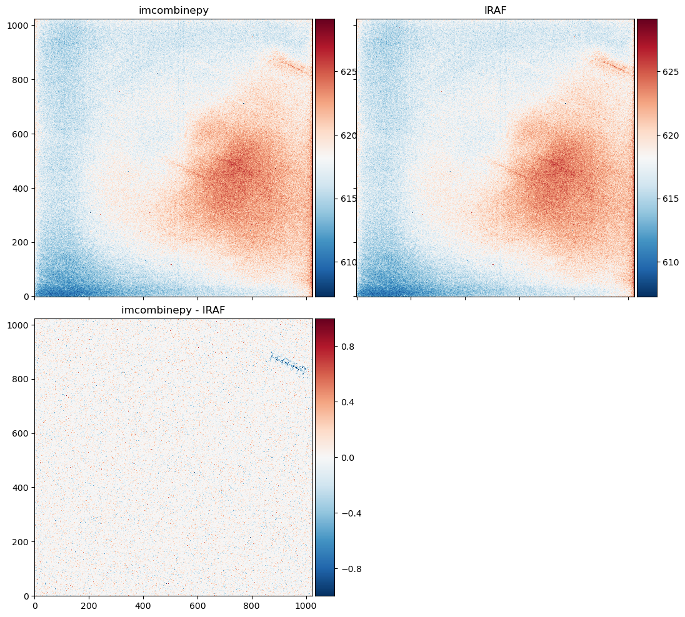

.. currentmodule:: imcombinepy.combine

.. _IRAFcomparison:

####################
Comparison with IRAF
####################
.. _IMCOMBINE: https://iraf.net/irafhelp.php?val=imcombine&help=Help+Page

:func:`imcombinepy.combine.fitscombine` function is made to **replace** IRAF's `IMCOMBINE`_. It is using :func:`imcombinepy.combine.ndcombine`, but in a way that is designed for FITS file formats. I tried to follow IRAF's IMCOMBINE, while some parts are changed.

At the moment (2020-07-20 12:24:24 (KST: GMT+09:00)), the ``testcombine`` folder which contains all the data (FITS files) I used below is **available via my personal** `Dropbox`_.

For the generation of all test FITS files, I fixed the following arguments to `IMCOMBINE`_::

    IRAF IMCOMBINE        imcombinepy
  * nkeep = 3             nkeep=3, maxrej=ncombine
  * lsigma, hsigma = 2    sigma=(2,2)
  * sigscale = 0          non-zero sigscale not implemented
  * mclip+                cenfunc='median'

i.e., I did **median-centered 2-sigma clipping if rejection is turned on**. The output file name has the following convention::

  <offsets>_<combine>_<reject>_<zero>_<scale>[_mask/_nrej/_sigma].fits

If ``'none'`` is used, it is denoted as ``x``. The offsets are set to none (i.e., image coordinate) most of the time, because IRAF seems to calculate the WCS offset incorrectly (see note in :func:`~imcombinepy.combine.fitscombine`'s ``offsets`` argument).

Testing IRAF Results
--------------------
In IRAF `IMCOMBINE`_, we can specify output files. I used, e.g., the following CL sclipt::

  !rm x_med_sc_x_x*.fits
  imcomb *2005UD* combine=med offsets='none' scale='none' zero='none' reject=sigclip lsigma=2 hsigma=2 mclip+ nkeep=3 sigscale=0 output=x_med_sc_x_x.fits rejmask=mask nrejmasks=nrej sigma=sigma
  imcopy mask.pl x_med_sc_x_x_mask.fits
  imcopy nrej.pl x_med_sc_x_x_nrej.fits
  imcopy sigma.fits x_med_sc_x_x_sigma.fits
  !rm *.pl sigma.fits

The log looks like this::

  Jul 15 10:25: IMCOMBINE
    combine = median, scale = none, zero = none, weight = none
    reject = sigclip, mclip = yes, nkeep = 3
    lsigma = 2., hsigma = 2.
    blank = 0.

                  Images
    bdfc_2005UD_20181012-140207_R_60.0.fits
    bdfc_2005UD_20181012-140703_R_60.0.fits
    bdfc_2005UD_20181012-141159_R_60.0.fits
    bdfc_2005UD_20181012-141654_R_60.0.fits
    bdfc_2005UD_20181012-142150_R_60.0.fits
    bdfc_2005UD_20181012-142646_R_60.0.fits
    bdfc_2005UD_20181012-143142_R_60.0.fits
    bdfc_2005UD_20181012-143637_R_60.0.fits
    bdfc_2005UD_20181012-144133_R_60.0.fits
    bdfc_2005UD_20181012-144629_R_60.0.fits
    bdfc_2005UD_20181012-145126_R_60.0.fits
    bdfc_2005UD_20181012-145621_R_60.0.fits

    Output image = x_med_sc_x_x.fits, ncombine = 12
    Rejection mask = mask.pl
    Number rejected mask = nrej.pl
    Sigma image = sigma
  mask.pl -> x_med_sc_x_x_mask.fits
  nrej.pl -> x_med_sc_x_x_nrej.fits
  sigma.fits -> x_med_sc_x_x_sigma.fits

Here I obtain the 3-D mask ``blahblah_mask.fits``. Then I can check

#. When ``reject=none`` in IRAF,
    - ``mask`` must be all ``False``. (CONFIRMED)
    - The output must be identical to the naive combination (``np.nanmedian(allimage, axis=0)``) (CONFIRMED)
#. ``np.sum(mask, axis=0)`` identical to ``_nrej.fits`` file? (CONFIRMED)
#. Median of ``original[~mask]`` along ``axis=0`` identical to output of IRAF? (**NO**)
#. Sigma of ``original[~mask]`` along ``axis=0`` identical to output sigma of IRAF? (**NO**)
#. ``((data3d < (comb_iraf - 2*sigma_iraf)) | (data3d > (comb_iraf + 2*sigma_iraf)))`` identical to ``mask``? (**NO**)

Although one who is interested in the reasons can check the source codes of IRAF and compare it with this package, I don't think that's very necessary at the moment, because it is likely due to the finely-tuned algorithms working behind the scenes under IRAF. (Note that ``imcombinepy``'s sigma-clipping is slightly different from that of IRAF and ``astropy``: the rejection of the latter two are *cumulative*. See the `astropy GitHub issue <https://github.com/astropy/astropy/issues/7424>`_). I compared the combined results from ``imcombinepy`` and IRAF for few images I had, and interestingly, some of artifact-like features visible in the IRAF result is not seen in ``imcombinepy`` results. Therefore, I just stick to the development of ``imcombinepy``, not being bothered by the minor inconsistencies.

Codes
^^^^^
The codes for testing items to check the IRAF results are given below:

.. code-block:: python

    import glob
    from astropy.stats import sigma_clipped_stats, sigma_clip
    from astropy.io import fits
    import bottleneck as bn
    from matplotlib import pyplot as plt
    import imcombinepy as icp

    fpaths = icp.filelist("testcombine/*2005UD*.fits")
    data3d = []
    for fpath in fpaths:
        data3d.append(fits.open(fpath)[0].data)
    data3d = np.array(data3d)

    fprefix = "x_med_sc_x_x"
    comb_iraf = fits.open(f"testcombine/{fprefix}.fits")[0].data
    mask_iraf = fits.open(f"testcombine/{fprefix}_mask.fits")[0].data.astype(bool)
    sigma_iraf = fits.open(f"testcombine/{fprefix}_sigma.fits")[0].data
    nrej_iraf = fits.open(f"testcombine/{fprefix}_nrej.fits")[0].data

    # Test of item 1&2
    np.testing.assert_array_almost_equal(np.sum(mask_iraf, axis=0), nrej_iraf)
    if fprefix.endswith('_x_x_x'):  # if no rejection happened
        assert np.count_nonzero(mask_iraf) == 0
        assert np.count_nonzero(bn.median(data3d, axis=0) != comb_iraf) == 0

    # Test of item 3
    data3d_nan = data3d.copy()
    data3d_nan[mask_iraf] = np.nan
    comb_iraf_test = bn.nanmedian(data3d_nan, axis=0)
    np.testing.assert_array_almost_equal(comb_iraf_test, comb_iraf)

    # Test of item 4
    low_iraf = comb_iraf - sigma_iraf*2
    upp_iraf = comb_iraf + sigma_iraf*2
    mask_test = (data3d < low_iraf)|(data3d > upp_iraf)
    np.testing.assert_array_almost_equal(mask_iraf, mask_test)

The last tests fails with the following error message::

  ---------------------------------------------------------------------------
  AssertionError                            Traceback (most recent call last)
  <ipython-input-7-96723bf8c563> in <module>
       30 data3d_nan[mask_iraf] = np.nan
       31 comb_iraf_test = bn.nanmedian(data3d_nan, axis=0)
  ---> 32 np.testing.assert_array_almost_equal(comb_iraf_test, comb_iraf)

      [... skipping hidden 2 frame]

  AssertionError:
  Arrays are not almost equal to 6 decimals

  Mismatched elements: 56893 / 1048576 (5.43%)
  Max absolute difference: 25.471558
  Max relative difference: 0.04220776
   x: array([[590.2518 , 591.7997 , 604.74963, ..., 599.0934 , 601.85474,
          612.655  ],
         [597.7123 , 591.2198 , 589.5432 , ..., 601.42896, 603.2619 ,...
   y: array([[592.3523 , 591.7997 , 604.74963, ..., 599.0934 , 601.85474,
          612.655  ],
         [597.7123 , 591.2198 , 592.72424, ..., 601.42896, 603.2619 ,...

and::

    ---------------------------------------------------------------------------
    AssertionError                            Traceback (most recent call last)
    <ipython-input-9-9a2f4a2f149f> in <module>
        2 upp = comb_iraf + sigma_iraf*2
        3 mask_test = (data3d < low)|(data3d > upp)
    ----> 4 np.testing.assert_array_almost_equal(mask_iraf, mask_test)

        [... skipping hidden 2 frame]

    AssertionError:
    Arrays are not almost equal to 6 decimals

    Mismatched elements: 109684 / 8388608 (1.31%)
    x: array([[[False, False, False, ..., False, False, False],
            [False, False,  True, ..., False, False,  True],
            [False, False, False, ..., False, False, False],...
    y: array([[[False, False, False, ..., False, False, False],
            [False, False, False, ..., False, False, False],
            [False, False, False, ..., False, False, False],...

A hint is that ``np.count_nonzero(np.sum(mask_test, axis=0) - nrej_iraf < 0)`` gives ``20802`` while ``np.count_nonzero(np.sum(mask_test, axis=0) - nrej_iraf > 0)`` gives ``0``. Therefore, in IRAF, internally additional rejection or restoration is happening, while the output mask or nrej files are not updated. Also, IRAF seems to use **cumulative rejection scheme** (see astropy `issue`_), which sometimes give unexpected results (see my `comment`_).

.. _issue: https://github.com/astropy/astropy/issues/7350#issuecomment-379269582
.. _comment: https://github.com/astropy/astropy/issues/7424#issuecomment-661559817

Visual Comparison of IRAF and ``imcombinepy`` Results
-----------------------------------------------------

.. _`Dropbox`: https://www.dropbox.com/sh/ehe696rs0uvh6zd/AABQtCvLdiI133l2tB208wSNa?dl=0

.. code-block::

    import imcombinepy as icp

    def fnamecode(kwdict, key):
        try:
            val = kwdict[key]
        except KeyError:
            val = None
        return 'x' if val is None else str(val).lower()

    fpattern="testcombine/*2005UD*.fits"
    fpaths = icp.filelist(fpattern)

    combkw = dict(
        offsets=None,
        combine='med',
    #     scale="med",
        zero="med",
        zero_to_0th=True,
        reject='sc',
        cenfunc='med',
        sigma=(2, 2),
        ddof=1,
        maxiters=10,
        verbose=True,
        overwrite=True,
        nkeep=3,
        irafmode=True,
        memlimit=4.e+9,
        return_dict=True,
        full=True,
    )

    fstem = "{}_{}_{}_{}_{}".format(
        fnamecode(combkw, 'offsets'),
        fnamecode(combkw, 'combine'),
        fnamecode(combkw, 'reject'),
        fnamecode(combkw, 'zero'),
        fnamecode(combkw, 'scale')
    )
    fname = fstem + ".fits"

    print(fname)
    res = icp.fitscombine(fpaths=fpaths, output=fname, **combkw)

    from astropy.stats import sigma_clipped_stats
    from astropy.io import fits
    from matplotlib import pyplot as plt
    from mpl_toolkits.axes_grid1 import ImageGrid

    comb_iraf = fits.open(f"testcombine/{fname}")[0].data

    comb = res['comb'].data

    imgrid_kw = dict(
        nrows_ncols=(2, 2),
        axes_pad=(0.35, 0.35),
        label_mode="L", #"L"
        share_all=True,
        cbar_location="right",
        cbar_mode="each", #"each",
        cbar_size="7%",
        cbar_pad="1%"
    )

    _, med, std = sigma_clipped_stats(comb, sigma=3, maxiters=5, std_ddof=1)
    vv = dict(vmin = med - 3*std, vmax = med + 3*std)

    toplot = [
        dict(X=comb, **vv),
        dict(X=comb_iraf, **vv),
        dict(X=comb-comb_iraf, vmin=-1, vmax=1),
        dict(X=None)
    ]

    fig = plt.figure(figsize=(12, 10))

    # sub-gridding one of the Axes (see nrows_ncols)
    grid = ImageGrid(fig, '111', **imgrid_kw)

    for ax, cax, items, tit in zip(grid, grid.cbar_axes, toplot,
                                ["imcombinepy", "IRAF", "imcombinepy - IRAF", '']):
        if items['X'] is None:
            ax.axis("off")
            cax.axis("off")
        else:
            im = ax.imshow(**items, origin='lower', cmap='RdBu_r')
            cax.colorbar(im)
            ax.set_title(tit, fontsize=12)
    #     cax.set_xticklabels(np.around(cax.get_xticks(), 3), rotation=90, fontsize=10, horizontalalignment='center', verticalalignment='center')
    # grid.cbar_axes[0].colorbar(im)

    plt.tight_layout()

    plt.savefig("comparison_wcs_sc_x_x.png", dpi=100, bbox_inches = "tight")

An example of the view:

.. image:: _static/comparison_x_med_sc_med_x_hist.png

(drew by ``ax.hist((comb-comb_iraf).ravel(), bins=100)``)

The difference is not very large, although I am not so comfortable. Some mismatches are, I guess, due to the internal additional rejection/restoration inside IRAF.

